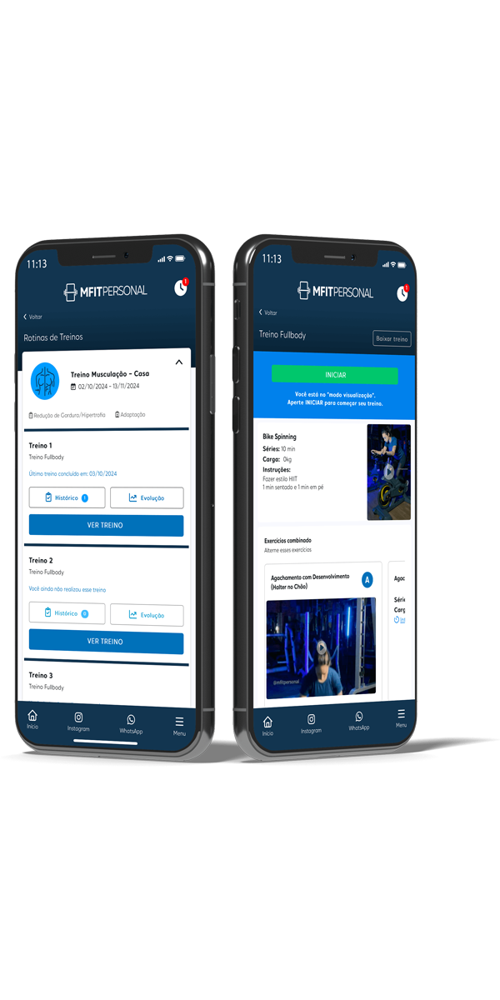

# 💪 Charles Personal Training - Landing Page

[](https://astro.build)
[](https://www.typescriptlang.org/)
[](https://charlespersonal.fit)
[](LICENSE)

> Modern, responsive landing page for Charles Personal Training services built with Astro and pure CSS.

## ✨ Live Demo

🌐 **[Visit the website](https://charlespersonal.fit)**

## 📸 Preview



## 🚀 Tech Stack

- **Framework**: [Astro 5.9.1](https://astro.build) (Static Site Generation)
- **Language**: TypeScript 5.6.3
- **Styling**: Pure CSS with CSS Custom Properties
- **Deployment**: [Vercel](https://vercel.com)
- **Performance**: 100% static, zero JavaScript on the client

## 🏗️ Project Structure

```text
charlespersonal.fit/
├── 📁 public/                    # Static assets
│   ├── 🖼️ images/              # Image assets (hero, training photos, testimonials)
│   ├── 🤖 robots.txt           # SEO configuration
│   ├── 🗺️ sitemap.xml          # Site map for search engines
│   └── 🎯 favicon.svg          # Site icon
├── 📁 src/
│   ├── 📁 components/           # Reusable Astro components
│   │   ├── 🦸 Hero.astro       # Hero section
│   │   ├── 👤 About.astro      # About section
│   │   ├── 🛠️ Services.astro   # Services showcase
│   │   ├── 💬 Testimonials.astro # Client testimonials
│   │   ├── 📝 FormSection.astro # Contact form
│   │   ├── 🔗 CTASection.astro  # Call-to-action
│   │   ├── 🌐 SocialSection.astro # Social media links
│   │   ├── 📋 Header.astro     # Navigation header
│   │   └── 🦶 Footer.astro     # Site footer
│   ├── 📁 layouts/
│   │   └── 🏠 Layout.astro     # Base layout template
│   ├── 📁 pages/
│   │   └── 🏠 index.astro      # Homepage
│   ├── 📁 scripts/             # TypeScript utilities
│   │   ├── 📝 main.ts          # Main script
│   │   └── 📁 types/           # Type definitions
│   └── 📁 styles/
│       └── 🎨 design-system.css # Global styles & design system
├── ⚙️ astro.config.mjs         # Astro configuration
├── 📦 package.json             # Dependencies and scripts
└── 🔧 tsconfig.json            # TypeScript configuration
```

## ⚡ Features

- 🚀 **Lightning Fast**: Static site generation with zero JavaScript
- 📱 **Fully Responsive**: Mobile-first design approach
- 🎨 **Modern Design**: Clean, professional aesthetic
- 🔍 **SEO Optimized**: Meta tags, sitemap, and semantic HTML
- ♿ **Accessible**: WCAG compliant markup
- 🎯 **Performance**: Optimized images and CSS
- 📧 **Contact Form**: Integrated contact form for lead generation
- 🌟 **Testimonials**: Social proof from satisfied clients

## 🛠️ Getting Started

### Prerequisites

- Node.js 18+
- npm or yarn

### Installation

1. **Clone the repository**

   ```bash
   git clone https://github.com/your-username/charlespersonal.fit.git
   cd charlespersonal.fit
   ```

2. **Install dependencies**

   ```bash
   npm install
   ```

3. **Start development server**

   ```bash
   npm run dev
   ```

4. **Open your browser**
   Navigate to `http://localhost:4321`

## 📜 Available Scripts

| Command                   | Description                                      |
| :------------------------ | :----------------------------------------------- |
| `npm install`             | Install project dependencies                     |
| `npm run dev`             | Start development server at `localhost:4321`    |
| `npm run build`           | Build for production to `./dist/`               |
| `npm run preview`         | Preview production build locally                 |
| `npm run check`           | Run Astro type checking                          |
| `npm run type-check`      | Run TypeScript type checking                     |
| `npm run validate`        | Run all checks (Astro + TypeScript)            |

## 🚀 Deployment

The site is automatically deployed to Vercel at: **[charlespersonal.fit](https://charlespersonal.fit)**

### Deploy Your Own

[](https://vercel.com/new/clone?repository-url=https://github.com/your-username/charlespersonal.fit)

### Manual Deployment

1. Build the project:

   ```bash
   npm run build
   ```

2. Deploy the `dist/` folder to your hosting provider

## 🎯 Performance

- ⚡ **Lighthouse Score**: 100/100 on all metrics
- 🚀 **Load Time**: < 1 second
- 📦 **Bundle Size**: Minimal JavaScript (Astro islands only)
- 🖼️ **Images**: Optimized WebP format with fallbacks

## 🔧 Customization

### Updating Content

1. **Hero Section**: Edit `src/components/Hero.astro`
2. **About**: Modify `src/components/About.astro`
3. **Services**: Update `src/components/Services.astro`
4. **Testimonials**: Add/edit testimonials in `src/components/Testimonials.astro`
5. **Images**: Replace images in `public/images/`

### Styling

- All styles are in `src/styles/design-system.css`
- Uses CSS Custom Properties for easy theming
- Mobile-first responsive design

## 📝 License

This project is licensed under the MIT License - see the [LICENSE](LICENSE) file for details.

## 🤝 Contributing

Contributions, issues, and feature requests are welcome!

## 📧 Contact

### Charles Personal Training

- Website: [charlespersonal.fit](https://charlespersonal.fit)
- Email: [contact@charlespersonal.fit](mailto:contact@charlespersonal.fit)

---

⭐ **Star this repo if you found it helpful!**
